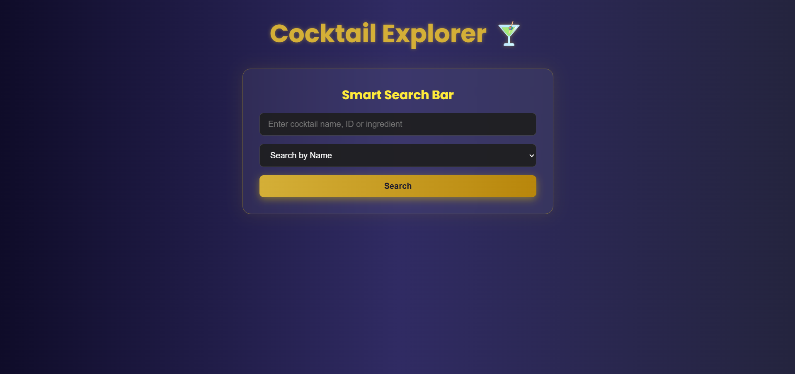
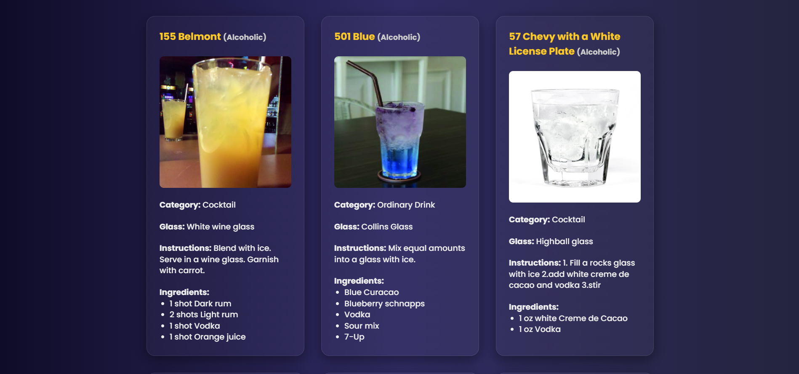

# 🍸 Cocktail Explorer

Welcome to **Cocktail Explorer**, a fun web app that lets you search and explore a wide variety of cocktails using the [CocktailDB API](https://www.thecocktaildb.com/).

---
## 🧠 What is Cocktail Explorer?

**Cocktail Explorer** is a web app that allows users to search and explore cocktails using the [CocktailDB API](https://www.thecocktaildb.com/api.php). Built using Node.js and Express, this project fetches real-time data from a public API and presents it in a clean, dynamic web interface.

Whether you’re a mixology enthusiast or just someone looking for a fun weekend recipe, this app is for you! 🍸

---
## 🌐 Live Demo

🔗 [Visit Cocktail Explorer on Render](https://cocktail-explorer.onrender.com) <!-- Replace with your actual link after deployment -->

---

## 💻 Tech Stack

| Tech         | Role                          |
|--------------|-------------------------------|
| Node.js      | Backend server                |
| Express.js   | Routing and server framework  |
| Axios        | API calls to CocktailDB       |
| EJS          | Template rendering            |
| HTML/CSS     | UI design                     |
| JavaScript   | Interactivity (minimal)       |

---

## ✨ Features

- 🔍 **Search Cocktails** by name
- 🧪 **Filter** by Alcoholic / Non-Alcoholic
- 📋 **View Details** – Ingredients, Instructions, and Glass Type
- 📸 **Images** for every cocktail
- 💥 **Error Handling** for missing results
- 🎨 Clean and responsive layout using EJS + CSS

---

## 📷 Screenshots


| Homepage | Search Result |
|----------|----------------|
|  |  |

---
## 🚀 How to Run Locally

### 1. Clone the Repository

```bash
git clone https://github.com/TharunKrishna-spec/COCKTAIL.git
cd COCKTAIL
```

### 2. Install Dependencies

```bash
npm install
```

### 3. Run the Server

```bash
node index.js
```

### 4. Open in Browser

Visit: [http://localhost:3000](http://localhost:3000)

---

## 🧪 Example Search URLs

Here are some example links powered by the CocktailDB API:

- [🔍 Search "Margarita"](https://www.thecocktaildb.com/api/json/v1/1/search.php?s=margarita)
- [🆔 Search by ID (e.g., 11007)](https://www.thecocktaildb.com/api/json/v1/1/lookup.php?i=11007)
- [🍷 Filter by Alcoholic Drinks](https://www.thecocktaildb.com/api/json/v1/1/filter.php?a=Alcoholic)

---


## 🚀 Deployment Guide (Render)

Want to deploy it yourself?

1. Create a free account at [render.com](https://render.com)
2. Click **New Web Service**
3. Connect your GitHub repo
4. Fill in the following:

```
Build Command:  npm install
Start Command:  node index.js
Environment:    Node
```

5. Click **Create Web Service** — and you're live!

---
## 📁 Folder Structure

COCKTAIL/
├── public/ # Static files (CSS, images)
├── views/ # EJS templates
│ ├── index.ejs
│ └── result.ejs
├── index.js # Main server file
├── package.json
├── .gitignore
└── README.md


## 🧠 Learnings & Takeaways

- Integrated REST APIs using **Axios**
- Worked with **Express** and route handling
- Dynamic rendering using **EJS templates**
- Strengthened skills in **debugging** and **error handling**

---

## 📌 Future Improvements

- ✅ Search by ingredients
- 📱 Add mobile responsiveness
- 💬 Add a feedback or rating feature
- 🎯 Save favorite cocktails using local storage or a database

---

## 🙌 Acknowledgements

- Huge thanks to **[TheCocktailDB](https://www.thecocktaildb.com/)** for their amazing open-source API.

---

## ✍️ Author

**Tharun Krishna Suresh**  
🎓 Electronics and Computer engineering @ Vellore Institute of technology Chennai
💡 Passionate about web dev ,electronics,AI and ML  
🔗 [GitHub](https://github.com/TharunKrishna-spec)  
🔗 [LinkedIn](https://www.linkedin.com/in/tharun-krishna-aa5580324/)

---


_Enjoy exploring cocktails responsibly! 🥂_