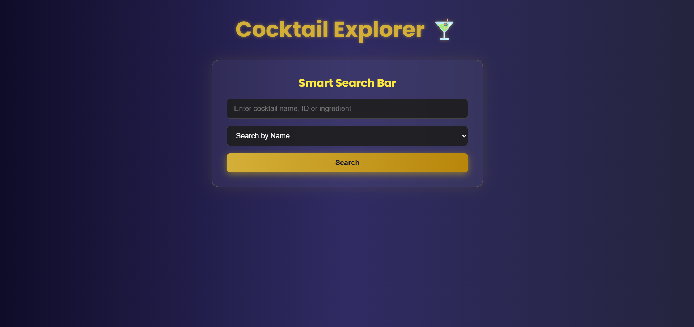

# 🍸 Cocktail Explorer

Welcome to **Cocktail Explorer**, a fun web app that lets you search and explore a wide variety of cocktails using the [CocktailDB API](https://www.thecocktaildb.com/).

---

## 🚀 How to Run Locally

### 1. Clone the Repository

```bash
git clone https://github.com/TharunKrishna-spec/COCKTAIL.git
cd COCKTAIL
```

### 2. Install Dependencies

```bash
npm install
```

### 3. Run the Server

```bash
node index.js
```

### 4. Open in Browser

Visit: [http://localhost:3000](http://localhost:3000)

---

## 🧪 Example Search URLs

Here are some example links powered by the CocktailDB API:

- [🔍 Search "Margarita"](https://www.thecocktaildb.com/api/json/v1/1/search.php?s=margarita)
- [🆔 Search by ID (e.g., 11007)](https://www.thecocktaildb.com/api/json/v1/1/lookup.php?i=11007)
- [🍷 Filter by Alcoholic Drinks](https://www.thecocktaildb.com/api/json/v1/1/filter.php?a=Alcoholic)

---

## 📷 Screenshots


| Homepage | Search Result |
|----------|----------------|
|  |  |

---

## 🚀 Deployment Guide (Render)

Want to deploy it yourself?

1. Create a free account at [render.com](https://render.com)
2. Click **New Web Service**
3. Connect your GitHub repo
4. Fill in the following:

```
Build Command:  npm install
Start Command:  node index.js
Environment:    Node
```

5. Click **Create Web Service** — and you're live!

---

## 🧠 Learnings & Takeaways

- Integrated REST APIs using **Axios**
- Worked with **Express** and route handling
- Dynamic rendering using **EJS templates**
- Strengthened skills in **debugging** and **error handling**

---

## 📌 Future Improvements

- ✅ Search by ingredients
- 📱 Add mobile responsiveness
- 💬 Add a feedback or rating feature
- 🎯 Save favorite cocktails using local storage or a database

---

## 🙌 Acknowledgements

- Huge thanks to **[TheCocktailDB](https://www.thecocktaildb.com/)** for their amazing open-source API.

---

## ✍️ Author

**Tharun Krishna Suresh**  
🎓 Electronics and Computer engineering @ Vellore Institute of technology Chennai
💡 Passionate about web dev ,electronics,AI and ML  
🔗 [GitHub](https://github.com/TharunKrishna-spec)  
🔗 [LinkedIn](https://www.linkedin.com/in/tharun-krishna-aa5580324/)

---


_Enjoy exploring cocktails responsibly! 🥂_